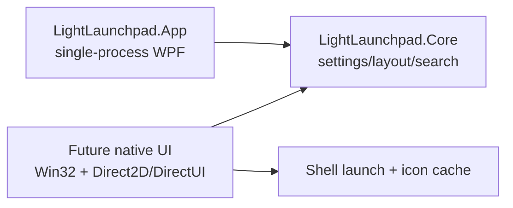

# LightLaunchpad Performance Route

## Requirements

1. Must keep repeated launchpad opening fast and fluid.
2. Must preserve search text and icon state while the app remains running.
3. Must keep layout, settings, icon cache, region editing, and launch behavior stable.
4. Must not present the split-process agent as the primary performance route because WPF cold startup is visibly slower.
5. Must pursue true low-memory and high-fluidity through a LightFrame-style native UI route, not through a resident mini-host that cold-launches WPF.
6. Must make later Everything integration possible without putting indexing work into a hot UI path.

## Chosen Route

Use the WPF app as the default package and startup target for the current release:

- `LightLaunchpad.App`: single-process WPF UI with hotkey, tray, cached icon state, and fast repeated show/hide.
- `LightLaunchpad.Core`: shared contracts for settings, layout, search, and pure logic.
- `LightLaunchpad.Agent` / `LightLaunchpad.NativeAgent`: retained only as experimental code for historical comparison, not packaged or selected by startup registration.

The next real low-memory route is a native UI runtime:

- C++ Win32 process owns hotkey, tray, window, input, rendering, and launch actions.
- Direct2D/DirectWrite or a compact DirectUI layer renders the launchpad directly.
- Core layout/search/settings contracts remain reusable, while WPF becomes an optional compatibility shell or is removed after the native UI is complete.

## Reference Notes

- reject: The agent route reduces idle memory numbers but cold-starts WPF, so it hurts the real interaction target.
- adopt: LightFrame's public repository describes its architecture as C/C++ native Windows API, DirectUI, and VertexUI. Its full source is private, so only the architecture direction is usable.
- adapt: Local LightFrame process evidence shows native does not automatically mean low memory when the full runtime is resident. The native rewrite must keep startup, icon loading, and search work incremental.
- keep: Current WPF app remains the responsive default until the native UI can replace it honestly.

## Architecture Sketch

## Success Criteria

- App tests cover search clear restoring icon state.
- App tests cover package defaulting to the single-process app.
- Startup registration points to the app process, not agent executables.
- Release packaging creates `LightLaunchpad-win-x64-<version>.zip`.
- Native UI plan is tracked as the real route for low memory plus fluid repeated opens.

## Open Questions

- Whether Everything integration should use `es.exe` first for validation or go straight to the SDK IPC.
- Whether the native UI should start with a read-only launcher surface first, then add editing, or port the full region editing model immediately.
