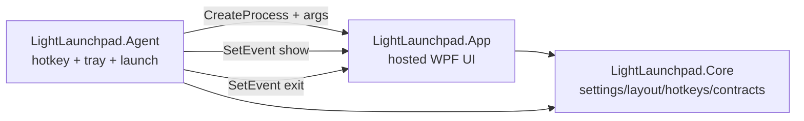

# LightLaunchpad Agent Route

## Requirements

1. Must reduce background residency by moving hotkey and tray ownership out of the WPF launchpad process.
2. Must keep the current launchpad and spotlight UI behavior available through an on-demand UI process.
3. Must follow the PowerToys Quick Access pattern where a small host controls a separate UI executable through process launch and lightweight activation signals.
4. Must keep the current standalone app path working during the transition unless a release explicitly switches the startup target.
5. Must preserve current layout, settings, icon cache, region editing, and launch behavior.
6. Must make later Everything integration possible without putting indexing or search work into the always-on process.

## Chosen Route

Use a split-process architecture:

- `LightLaunchpad.Agent`: always-on host for hotkey, tray, settings load, and UI process launch.
- `LightLaunchpad.App`: WPF UI process. In normal mode it remains compatible with the current app. In hosted mode it is shown by the agent and exits when hidden.
- `LightLaunchpad.Core`: shared contracts for activation arguments, settings, hotkeys, layout, and pure logic.

The agent launches the WPF UI with hosted arguments:

```text
LightLaunchpad.App.exe --hosted-ui --show-event=<event> --exit-event=<event> --show-immediately --exit-on-hide
```

The UI listens to named events for future keep-warm activation. In the first phase, it also exits after hide so the WPF memory footprint does not remain in the background.

## Reference Notes

- adopt: PowerToys Quick Access host starts the UI process from Runner and signals show/exit with named events.
- adopt: PowerToys uses a job object to clean up the UI if the host dies. LightLaunchpad should add this after the initial C# agent skeleton.
- adapt: PowerToys named pipe IPC is useful later for settings sync and query messages, but the first phase only needs activation arguments and named events.
- adapt: UI memory trim after hide can help perceived memory, but the durable memory reduction comes from exiting the UI process.
- reject: PowerToys module management, GPO, telemetry, and settings platform are not part of this app route.

## Architecture Sketch



## Success Criteria

- Solution builds with a new `LightLaunchpad.Agent` project.
- Core tests cover activation argument parsing.
- App tests cover hosted UI source wiring.
- Agent can launch the WPF UI with hosted arguments.
- WPF UI can exit on hide in hosted mode.
- Release packaging includes both executables.

## Open Questions

- Whether the final startup registration should point to `LightLaunchpad.Agent.exe` immediately or after one release of dual-mode validation.
- Whether the agent should be NativeAOT or C++ for a strict sub-10MB private memory target.
- Whether Everything integration should use `es.exe` first for validation or go straight to the SDK IPC.